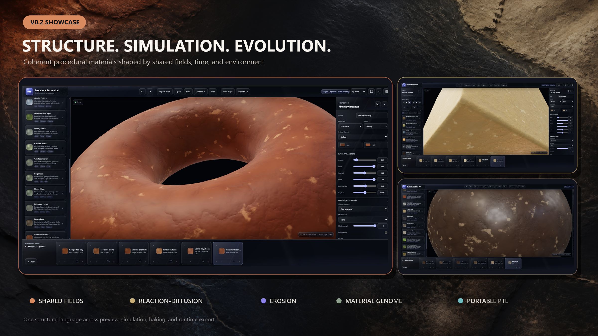
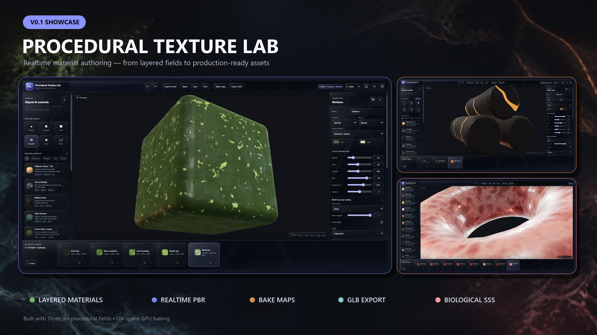

# Procedural Texture Lab

A realtime Three.js material playground for building layered procedural surfaces, previewing them on 3D meshes, and exporting practical PBR assets.

**Live demo:** [danielsobrado.github.io/procedural-texture-lab](https://danielsobrado.github.io/procedural-texture-lab/)

## V0.3 — Surface Designer (WIP)

V0.3 adds a Substance-style authored surface graph on top of the existing portable PTL material runtime. Graph-backed materials keep their node structure, reusable subgraphs, routing, and exposed controls while still compiling to the same WebGPU-first preview, portable GLSL bake/export, and `.ptl.json` runtime representation.

The Surface Designer adds a typed node catalog for shape/scatter/flood-fill workflows, height filters, warps, transforms, blends, histogram and color utilities, normal/PBR conversion, SDFs, reusable subgraphs, and PBR outputs. Every catalog node family has a generic executable lowering path, while explicit runtime bindings remain authoritative for hand-authored flagship materials.

Native pattern layers support brick, tile, plank, grass blades, pebble scatter, roof tiles, and woven fabric with direct controls for aspect, gap, roundness, jitter, rotation, row offset, density, and edge wear. Graph-backed presets expose high-level parameters directly in the Inspector and recompile without flattening the authored graph.

Flagship v0.3 materials include old brick wall, dense grass, river gravel, clay roof tiles, weathered wood planks, ceramic tiles, woven fabric, weathered concrete, aged plaster, road asphalt, and cobblestone.

Static GLB displacement can optionally use bounded pre-displacement tessellation for finer geometric relief. It is disabled by default and configured in `config/surface-designer.yaml` with edge-length, iteration, and vertex-budget limits. 

## V0.2 — Structure, Simulation & Evolution

V0.2 builds coherent materials from shared structural fields instead of treating every PBR channel as an unrelated noise stack. It adds reaction-diffusion and erosion simulations, SDF structures, an advanced dependency graph, environmental ageing, multi-scale synthesis, continuous anti-repetition, a lockable six-variant material genome, and a procedural terrain workspace in Tile Lab.

The interactive material preview is WebGPU-first. Texture baking and GLB export use a dedicated WebGL renderer because the portable bake shaders target GLSL, while procedural compute uses WebGPU where implemented and bounded cooperative CPU fallbacks otherwise. Preview, portable runtime recipes, baking, and GLB export consume the same material and simulation fields. If neither WebGPU nor WebGL2 can initialize, the editor falls back to a usable no-preview state; project editing and portable recipe export remain available, while GPU-only operations report the missing capability.



## V0.1 showcase



## What it does

- Builds materials from stackable noise, cells, ridges, spots, veins, vessels, wet-film, subsurface, reaction-diffusion, erosion, SDF, and native pattern layers
- Authors typed procedural surface graphs with reusable subgraphs and exposed parameters
- Supports masks, shared structure sources, groups, blend modes, displacement, and physical material controls
- Previews materials on built-in shapes or imported GLB/GLTF meshes
- Includes graph-backed architectural/surface materials plus stone, terrain, grass, moss, and biological presets
- Generates periodic mountainous terrain with drainage, rivers, wetness, automatic terrain material masks, wrapped material painting, 2D diagnostics, and an interactive 3D preview
- Imports repeating image textures into terrain paint slots and exports deterministic `.ptlmap.json` terrain recipes plus 16-bit R16 height data
- Bakes albedo, roughness, normal, height, clearcoat, clearcoat-roughness, metallic, AO, and emissive maps
- Exports portable GLB files with baked PBR textures and optional bounded micro-geometry for static displacement
- Exports small `.ptl.json` material recipes for runtime regeneration, including v0.3 surface graphs
- Saves and restores editor projects as JSON

The editor runs entirely in the browser. Imported models, terrain textures, and HDR files stay local and are never fetched from remote URLs.

## Run locally

```bash
npm ci
npm run dev
```

For a production build:

```bash
npm run build
npm run preview
```

## Controls

| Action          | Control                                      |
| --------------- | -------------------------------------------- |
| Orbit           | Left drag                                    |
| Pan             | Right drag                                   |
| Zoom            | Wheel or pinch                               |
| Frame selection | `F`                                        |
| Wireframe       | `W`                                        |
| Radial menu     | Right click,`Space`, or touch and hold     |
| Undo            | `Ctrl/Cmd + Z`                             |
| Redo            | `Ctrl/Cmd + Shift + Z` or `Ctrl/Cmd + Y` |

## Surface Designer

Choose a Surface Designer preset to load an authored graph. High-level graph parameters appear in the Inspector and remain connected to their graph nodes. Enable **Advanced graph** to inspect node categories, runtime lowering, ports, routes, and reusable subgraphs.

Selecting a native `Pattern sampler` layer exposes the low-level pattern controls. Editing a low-level layer or group intentionally detaches the authored graph because that edit may no longer be representable by its high-level graph. Editing an exposed graph parameter preserves and recompiles the graph.

Surface Designer configuration lives in `config/surface-designer.yaml`. The graph and pattern implementation is shared by WebGPU preview and portable baking/export paths rather than maintaining a separate preset-only renderer.

## Baking and export

Static meshes can receive generated atlas UVs when their source UVs are not safe to bake. Skinned and morph-target meshes keep their topology and need valid source UVs.

GLB export preserves the original hierarchy, transforms, animations, and untouched materials. Procedural layers are converted to standard PBR textures so the result works in regular glTF viewers. Biological subsurface scattering is approximated because glTF has no direct equivalent.

Simulation-backed layers are prepared before texture or GLB export so baked output matches the hydrated editor material instead of silently falling back to the analytic preview approximation.

When `microGeometry.enabled` is enabled in `config/surface-designer.yaml`, static displaced meshes are tessellated before the baked height map is applied. The exporter reduces tessellation automatically when needed to remain within the configured vertex budget and never mutates the source geometry.

## Tile Lab terrain

Tile Lab opens in terrain mode and generates a periodic world domain so mountain height, river fields, material masks, and manual paint wrap at tile boundaries. Diagnostic views expose height, slope, flow, rivers, wetness, and a repeated 3 × 3 map.

Manual terrain paint is recorded as normalized brush strokes instead of embedding a large raster mask. This keeps `.ptlmap.json` exports compact and resolution-independent. Imported image textures and the current PTL material are external dependencies; terrain recipes declare those dependencies instead of embedding their bytes.

Height export writes little-endian unsigned 16-bit `.r16` data together with an 8-bit PNG preview. The terrain recipe records world size and height scale so consumers can reconstruct the physical elevation range.

## Portable runtime materials

Use **Export PTL** to save the authored surface as a small, versioned `.ptl.json` recipe without project-only viewport or imported-asset state. V0.3 recipes can include the normalized surface graph and regenerate canonical PTL runtime layers. Version-1 recipes remain supported and migrate in memory.

```ts
import {
  loadMaterialRecipe,
  ProceduralMaterial,
  setSurfaceGraphExposedValue,
  compileSurfaceGraph
} from 'procedural-texture-lab/runtime';

const recipe = await loadMaterialRecipe('/materials/brick.ptl.json');
const procedural = new ProceduralMaterial(recipe, {
  coordinateSpace: 'object'
});

await procedural.prepare();
procedural.applyTo(mesh);

if (recipe.graph) {
  const graph = setSurfaceGraphExposedValue(recipe.graph, 'mortar-gap', 0.12);
  const compiled = compileSurfaceGraph(graph);
  console.log(compiled.layers);
}
```

Use `coordinateSpace: 'object'` for moving props so the pattern stays attached to the mesh. Use `world` for terrain and world-aligned surfaces. Recipes exported by the editor default to `world` to preserve existing authored output.

For deterministic variants of the same family, change the recipe seed and prepare again when simulation-backed layers are present:

```ts
procedural.setSeed(93771);
await procedural.prepare();
```

`applyTo()` also assigns procedural depth and distance materials so displaced geometry casts matching shadows. Call `procedural.dispose()` with the rest of the mesh resources. Build and verify the standalone ES module with:

```bash
npm run test:runtime-package
```

Three.js remains external to the generated runtime bundle so the host game supplies the shared Three.js instance.

## Development

```bash
npm run test:unit
npm run test:browser
npm run test:runtime-package
npm run test:production-export
npm run test:cross-browser
npm run test:qa
```

The project uses TypeScript, Three.js, Vite, Vitest, and Playwright. Editor configuration lives in `config/`; portable material constraints, recipe algorithms, the material compiler, renderer, baker, exporter, terrain systems, and UI live under `src/`.

CI validates unit tests, the production build, and the standalone runtime package on changes to `main`. GitHub Pages publishing remains manual:

```bash
npm run deploy
```
